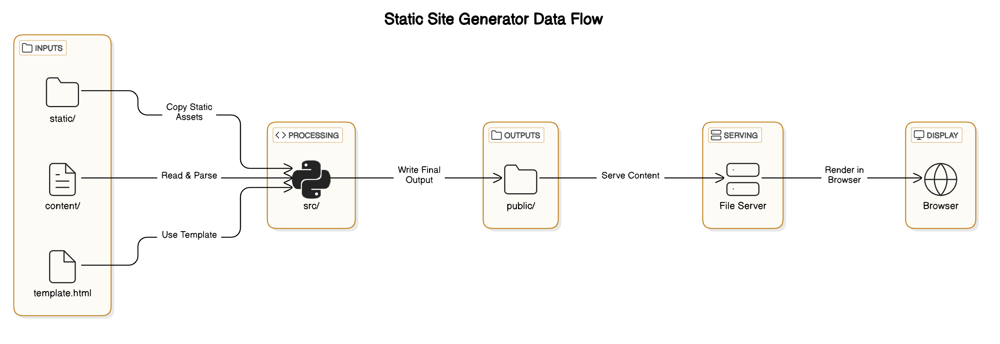

# Static-Site-Generator

A lightweight and customizable static site generator built from scratch. Designed for simplicity and flexibility, this tool transforms plain text and templates into fast, modern, and fully static websites — no frameworks, no unnecessary bloat.

## 📐 Architecture

Before diving into the code, here's a high-level overview of how this static site generator works.

### Flow of Data

1. **Markdown files** live in the `/content` directory. A `template.html` file is used for layout.
2. The static site generator (Python code in `/src/`) reads the Markdown and template files.
3. It **converts Markdown into HTML**, applies the template, and writes output to the `/public` directory.
4. A **Python HTTP server** serves files from `/public` to `http://localhost:8888`.
5. You open the browser and view the final site.

---

### System Diagram

 

---

### ⚙️ How the Static Site Generator (SSG) Works

Most of the action happens in the `/src/` directory. Here's a breakdown of the core steps:

1. **Clear the `/public` directory** to ensure a clean build.
2. **Copy static assets** (CSS, images, etc.) from `/static` to `/public`.
3. For each Markdown file in `/content`:
   - Read content and split it into logical blocks (e.g., paragraphs, headings, lists).
   - Convert Markdown blocks into a tree of `HTMLNode` objects.
     - For inline elements like bold text, links, etc.:
       ```
       Markdown -> TextNode -> HTMLNode
       ```
   - Combine all block nodes under a single parent `HTMLNode`.
   - Recursively call `.to_html()` on the root `HTMLNode` to generate the final HTML string.
   - Inject the generated content into `template.html`.
   - Write the final HTML file into `/public`.

---

### 📂 Project Structure

```
/project-root
  ├── content/              # Markdown files for content (e.g., blog posts, pages)
  ├── docs/                 # Output directory for the generated static site
  ├── src/                  # Python code for static site generation
  ├── static/               # Static assets (images, CSS, JavaScript, etc.)
  ├── .gitignore            # Folders and file git should ignore
  ├── LICENSE               # License file for the project
  ├── build.sh              # Python script to generate your static website for production
  ├── template.html         # HTML template for all pages
  ├── main.sh               # Python script to generate the static site
  ├── test.sh               # Python script to run all tests in the src directory using unittest discover
  └── README.md             # Documentation for the project (e.g., usage, setup instructions)
```

# Installation Instructions

## 1. Ensure Python3, Pip, and Git are installed:

### For Windows:
#### Python:
- Download and install Python from the official website: [https://www.python.org/downloads/](https://www.python.org/downloads/).
- During installation, make sure to check the box that says "Add Python to PATH".
- Verify installation by running in **Command Prompt**:
    ```bash
    python3 --version
    pip3 --version
    ```

#### git:
- Download and install Git from [https://git-scm.com/download/win](https://git-scm.com/download/win).
- Verify installation by running in **Command Prompt**:
    ```bash
    git --version
    ```

### For macOS:
#### Python 3 (and pip) are usually pre-installed. To check:
```bash
python3 --version
pip3 --version
```
- If missing, install Python 3 using:
    ```bash
    brew install python3
    ```

#### git:
- Git is generally pre-installed, but you can check with:
    ```bash
    git --version
    ```
- If not installed, use:
    ```bash
    brew install git
    ```

### For Linux (Ubuntu/Debian):
#### Python 3 and pip:
- Check if installed:
    ```bash
    python3 --version
    pip3 --version
    ```
- If not installed, run:
    ```bash
    sudo apt update
    sudo apt install python3 python3-pip
    ```

#### git:
- Check if installed:
    ```bash
    git --version
    ```
- If not installed, run:
    ```bash
    sudo apt install git
    ```

---

## 2. Clone the repository to your local machine:
Before cloning the repository, make sure **git** is installed. To clone the repository, run the following command in **Command Prompt** (Windows) or **Terminal** (macOS/Linux):

```bash
git clone https://github.com/wesonga/Static-Site-Generator
```

---

## 3. Navigate to the project directory:
Once the repository is cloned, change into the project directory:

```bash
cd Static-Site-Generator
```

---

### 4. 🚀 Run

To generate the static site and serve it locally, run with:

```bash
# Generate the site
python3 src/main.py

# Serve the site locally
python3 -m http.server 8888
```

Then open http://localhost:8888 in your browser to view the site.

## License
This project is open-source and available under the **[MIT License](LICENSE)**.